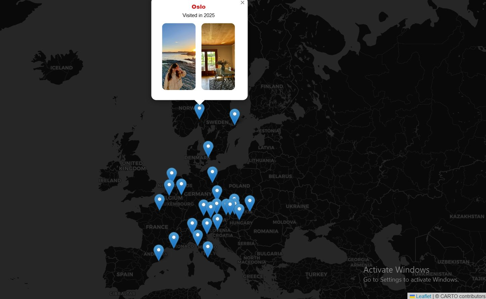

# Day 04: My Data

## Overview
Interactive web map visualizing personal travel data - European cities visited.



## Features
- 📍 **Custom markers** for each visited city
- 🖼️ **Photo popups** with city images
- 🗺️ **Interactive** - Click markers to view details
- 📊 **Personal dataset** - Real travel data

## Technical Implementation

**Web Map Stack:**
```javascript
// Leaflet.js initialization
const map = L.map('map').setView([50.0, 10.0], 4);
L.tileLayer('https://{s}.tile.openstreetmap.org/{z}/{x}/{y}.png').addTo(map);

// Add city markers with popups
cities.forEach(city => {
    L.marker([city.lat, city.lon])
        .bindPopup(`<br/><b>${city.name}</b>`)
        .addTo(map);
});
```

## Data Structure
- City name
- Latitude/Longitude coordinates
- Photo URL
- Visit date (optional)

## Tools Used
- **Leaflet.js** - Interactive web mapping
- **OpenStreetMap** - Basemap tiles
- **JavaScript** - Custom marker logic
- **HTML/CSS** - Page structure and styling

## Files
- `index.html` - Main web page
- `script.js` - Map logic and city data
- `style.css` - Custom styling
- `tumaristravel.jpg` - Showcase image
