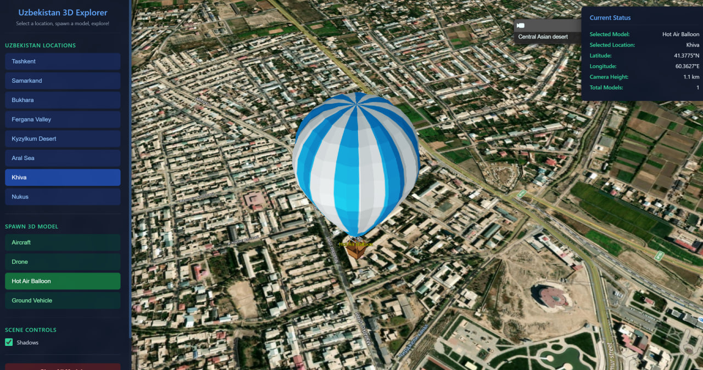

# Day 05: Earth

## Overview
Interactive 3D globe explorer for Uzbekistan using CesiumJS with spawnable 3D models.



## Features
- 🌍 **3D Earth Visualization** - Photorealistic globe with terrain
- 📍 **8 Uzbekistan Locations** - Tashkent, Samarkand, Bukhara, Fergana, Kyzylkum, Aral Sea, Khiva, Nukus
- ✈️ **4 Spawnable 3D Models** - Aircraft, Balloon, Drone, Vehicle
- 🎮 **Interactive Controls** - Click locations, spawn models, explore terrain

## Locations Showcased

| Location | Coordinates | Description |
|----------|-------------|-------------|
| Tashkent | 69.24°E, 41.30°N | Capital city |
| Samarkand | 66.98°E, 39.65°N | Historic Silk Road city |
| Bukhara | 64.42°E, 39.77°N | Ancient city center |
| Fergana Valley | 71.77°E, 40.38°N | Fertile valley region |
| Kyzylkum Desert | 64.50°E, 42.00°N | Desert landscape |
| Aral Sea | 59.50°E, 44.50°N | Shrinking sea |
| Khiva | 60.36°E, 41.38°N | Walled city |
| Nukus | 59.61°E, 42.45°N | Karakalpakstan capital |

## Technical Implementation

**3D Globe Setup:**
```javascript
// Initialize Cesium viewer
const viewer = new Cesium.Viewer('cesiumContainer', {
    terrainProvider: Cesium.createWorldTerrain(),
    imageryProvider: new Cesium.IonImageryProvider({ assetId: 2 })
});

// Fly to location
viewer.camera.flyTo({
    destination: Cesium.Cartesian3.fromDegrees(longitude, latitude, altitude),
    duration: 3
});
```

**3D Model Spawning:**
```javascript
// Load and place 3D model
const entity = viewer.entities.add({
    position: Cesium.Cartesian3.fromDegrees(lon, lat, height),
    model: {
        uri: './assets/models/aircraft.glb',
        scale: 5000
    }
});
```

## 3D Models Included
- `aircraft.glb` - Airplane model
- `balloon.glb` - Hot air balloon
- `drone.glb` - UAV drone
- `vehicle.glb` - Ground vehicle

## Tools Used
- **Cesium.js** - 3D geospatial visualization
- **GLB Models** - 3D model format
- **Cesium Ion** - Terrain and imagery provider
- **JavaScript** - Interactive controls

## Files
- `index.html` - Main application
- `main.js` - Cesium logic and model spawning
- `style.css` - UI styling
- `assets/models/` - 3D GLB models
