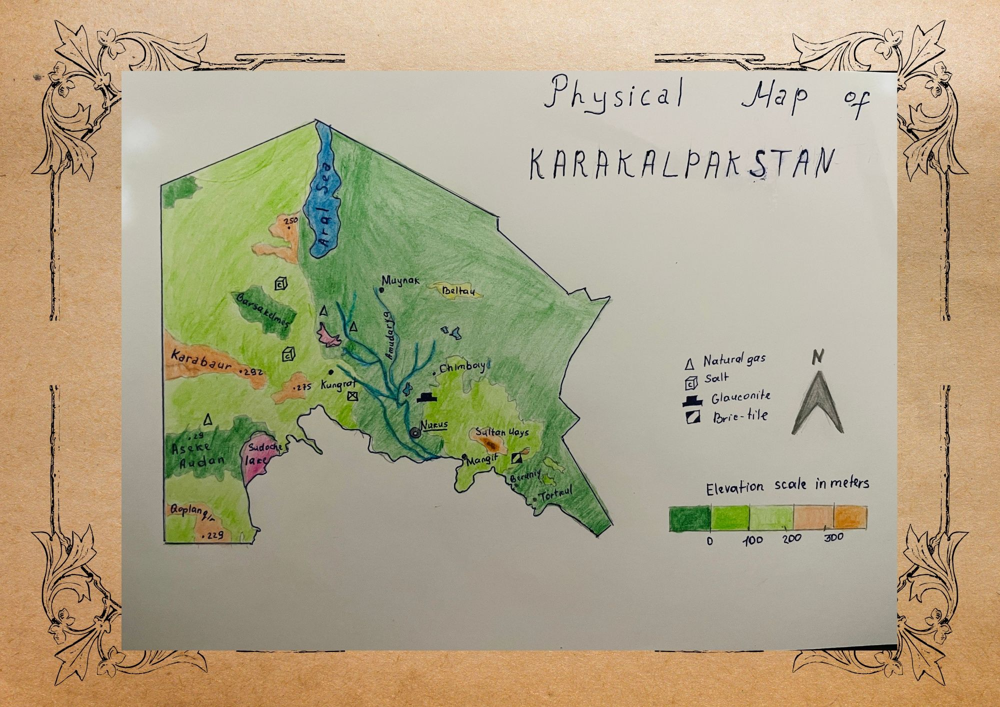

# Day 09: Analog

## Overview
Hand-drawn physical map of Karakalpakstan using traditional cartography methods - colored pencils on paper.

## Features Mapped
- 🏔️ **Elevation** - Mountain ranges and terrain
- 💧 **Rivers** - Water network
- 🌊 **Aral Sea** - Shrinking sea boundary
- 🏛️ **Settlements** - Major cities and towns
- 📍 **Borders** - Regional boundaries

## Traditional Cartography Process
1. Sketch base map outline
2. Mark major geographic features
3. Add rivers and water bodies
4. Draw elevation contours
5. Color-code natural features
6. Label settlements and landmarks

## Materials Used
- ✏️ **Colored pencils** - For feature differentiation
- 📄 **Paper** - Physical map base
- 📐 **Reference maps** - For accuracy
- 🎨 **Hand drawing** - Traditional technique

## Reflections
Taking a break from GIS to appreciate traditional cartography methods. This process highlights the patience and creativity required before digital mapping tools existed.

## Tools Used
**Traditional cartography** - Hand & colored pencils ✏️
