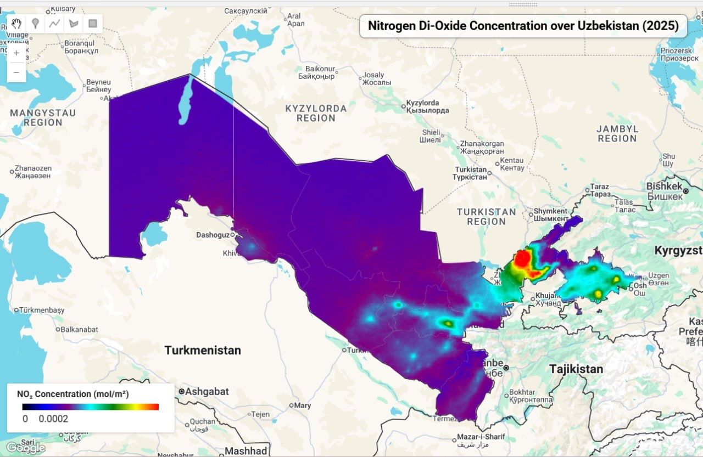

# Day 10: Air

## Overview
Nitrogen Dioxide (NO₂) concentration mapping over Uzbekistan using Sentinel-5P (TROPOMI) atmospheric data.



## Data & Methodology

**Satellite:** Sentinel-5P (TROPOMI sensor)
**Parameter:** NO₂ column number density (mol/m²)
**Time Period:** January - May 2025
**Platform:** Google Earth Engine
**Resolution:** ~7km atmospheric column

## Key Code Snippet

```javascript
// Load Sentinel-5P NO2 data
var no2 = ee.ImageCollection("COPERNICUS/S5P/OFFL/L3_NO2");

// Calculate mean NO2 concentration
var image = no2.filterDate('2025-01-01', '2025-05-30')
              .select('NO2_column_number_density')
              .mean()
              .clip(AOI);

// Visualization parameters
var band_viz = {
  min: 0,
  max: 0.0002,
  palette: ['black', 'blue', 'purple', 'cyan', 'green', 'yellow', 'red']
};

Map.addLayer(image, band_viz);
```

## NO₂ Pollution Indicators
- 🔴 **Red zones:** High concentration (industrial/urban areas)
- 🟡 **Yellow-green:** Moderate levels
- 🔵 **Blue-black:** Low concentration (rural areas)

## Air Quality Insights
- Urban centers show elevated NO₂ levels
- Major transportation corridors visible
- Seasonal variation in atmospheric composition
- Useful for air quality monitoring and health studies

## Interactive Map
🌐 **Google Earth Engine Code:** https://code.earthengine.google.com/d49cf8c9bf5907988c297f2e34a4c6c5

## Dataset
**Source:** COPERNICUS/S5P/NRTI/L3_NO2
**Provider:** European Space Agency (ESA)
**Access:** Google Earth Engine Data Catalog

## Tools Used
- Google Earth Engine (JavaScript API)
- Sentinel-5P TROPOMI
- Custom legend and visualization
