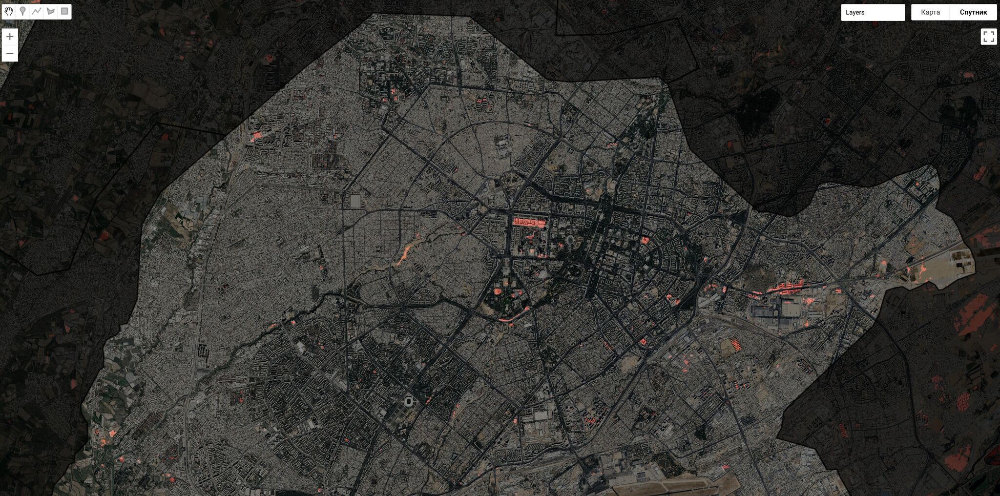

# Day 17: New Tool

## Overview
Exploring Carto platform for rapid spatial visualization - fire stations in Tashkent.

## New Tool: Carto
First-time use of Carto for interactive mapping and spatial analysis.

**Why Carto?**
- 🚀 **Fast** - Quick data import and visualization
- 🎨 **Easy styling** - Intuitive design interface
- 📊 **Built-in analysis** - Spatial operations without coding
- 🌐 **Cloud-based** - No local setup required
- 🔗 **Shareable** - Instant web deployment

## Project: Tashkent Fire Stations

**Data Source:** OpenStreetMap (fire stations)
**Visualization:** Interactive point map with clustering
**Analysis:** Spatial distribution and coverage

### Workflow
1. Extract fire station data from OSM
2. Import GeoJSON to Carto
3. Apply custom styling
4. Add popups and interactivity
5. Publish and share

## Interactive Map
🌐 **Live map:** https://lnkd.in/g9ub4WtD

## Carto Features Used
- Point symbolization
- Color ramps
- Pop-up configuration
- Basemap selection
- Data filtering
- Quick analytics

## Data
- `fire_stations_tashkent.geojson` - Fire station locations
- `Fire Station map of Tashkent.pdf` - Static export

## Comparison with Traditional Tools
**vs QGIS:** Faster web deployment, less local processing
**vs Python:** No coding required, instant visualization
**vs ArcGIS Online:** More affordable, cleaner interface

## Learning Outcome
Carto excels at rapid prototyping and sharing spatial data online. Perfect for quick exploratory analysis and stakeholder communication.

## Tools Used
- **Carto** - Web mapping platform (new!)
- **OpenStreetMap** - Data source
- **GeoJSON** - Data format
