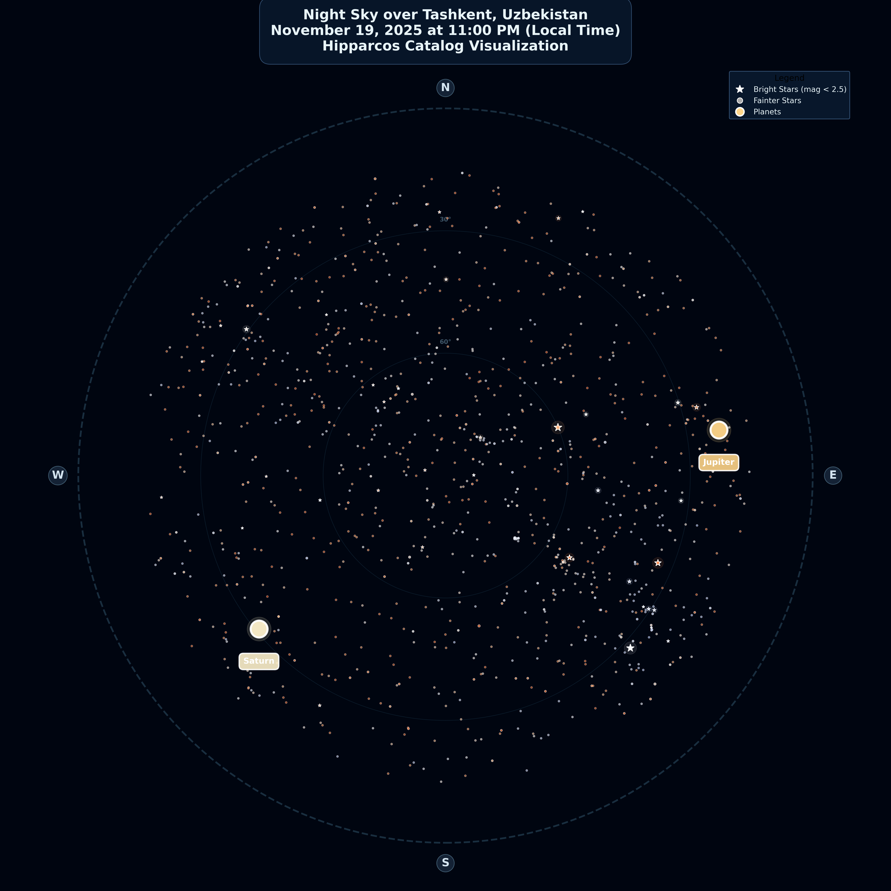

# Day 18: Out of this World

## Overview
Night sky star map visualization for Tashkent - astronomical cartography beyond Earth.



## Concept
Mapping the celestial sphere visible from Tashkent's geographic coordinates - bringing astronomy and cartography together.

## Star Catalog Data
**Source:** Astronomical star catalogs
**Projection:** Equatorial to horizontal coordinates
**Location:** Tashkent (41.2995°N, 69.2401°E)

## Astronomical Mapping

**Python Implementation:**
```python
# Star catalog visualization
import astropy
from astropy.coordinates import SkyCoord, AltAz, EarthLocation
from astropy.time import Time
import matplotlib.pyplot as plt

# Tashkent location
tashkent = EarthLocation(lat=41.2995, lon=69.2401, height=455)

# Get visible stars
time = Time('2025-01-01 22:00:00')
altaz_frame = AltAz(obstime=time, location=tashkent)

# Transform and plot stars
visible_stars = stars[stars.alt > 0]  # Above horizon
plt.scatter(visible_stars.az, visible_stars.alt,
           s=visible_stars.magnitude)
```

## Features Mapped
- ⭐ **Stars** - Brightness and position
- 🌌 **Constellations** - Star patterns
- 🪐 **Planets** - Visible from Tashkent
- 🌙 **Moon** - Position and phase
- 🔭 **Deep sky objects** - Galaxies, nebulae

## Celestial Coordinates
- **Right Ascension (RA)** - Celestial longitude
- **Declination (Dec)** - Celestial latitude
- **Altitude** - Angle above horizon
- **Azimuth** - Compass direction

## Files
- `starCatalog.py` - Python star mapping script
- `tashkent_night_sky.png` - Star map output

## Tools Used
- **Python** - Astropy, Matplotlib
- **Star catalogs** - Hipparcos, Yale Bright Star
- **Astronomical calculations** - Coordinate transformations

## Applications
- Amateur astronomy planning
- Educational planetarium displays
- Light pollution awareness
- Cultural astronomy heritage

## "Out of this World"
This project literally maps "out of this world" - the celestial sphere above Uzbekistan, connecting geographic location with astronomical observation.
