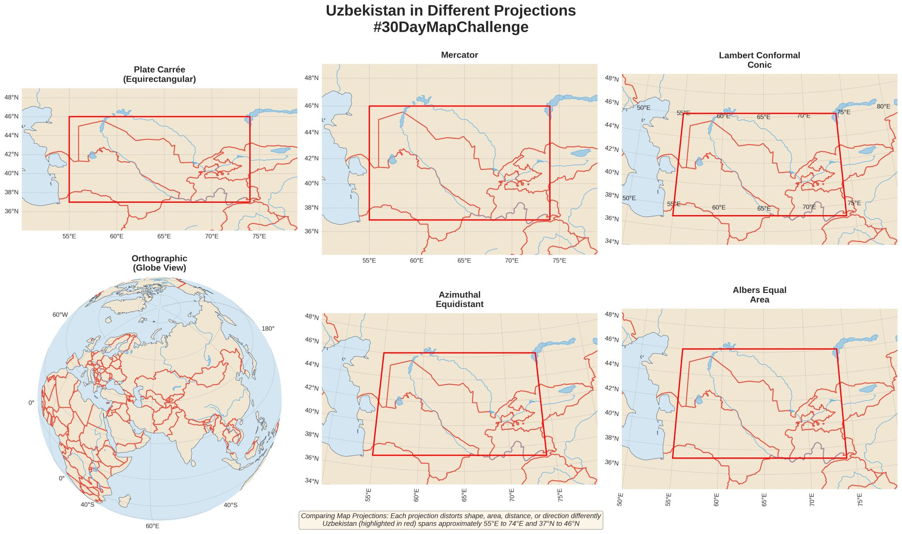

# Day 19: Projections

## Overview
Exploring different map projections for Uzbekistan - demonstrating how projection choice affects spatial representation.



## Map Projection Showcase

### Common Projections for Uzbekistan

**1. Web Mercator (EPSG:3857)**
- Standard for web maps (Google, OSM)
- Preserves angles but distorts area
- Poor for Central Asia latitude analysis

**2. WGS 84 / UTM Zone 41N (EPSG:32641)**
- Optimal for Uzbekistan (66-72°E)
- Minimal distortion for the region
- Good for accurate measurements

**3. Asia North Albers Equal Area (EPSG:102025)**
- Preserves area relationships
- Good for thematic mapping
- Accurate for statistical visualization

**4. Azimuthal Equidistant (centered on Tashkent)**
- Correct distances from center
- Useful for accessibility analysis
- Cultural/historical significance

## Projection Comparison Code

```python
import geopandas as gpd
import matplotlib.pyplot as plt

# Load Uzbekistan boundary
uzbek = gpd.read_file('uzbekistan.geojson')

# Compare projections
fig, axes = plt.subplots(2, 2, figsize=(12, 10))

projections = {
    'Web Mercator': 'EPSG:3857',
    'UTM 41N': 'EPSG:32641',
    'Albers Equal Area': 'EPSG:102025',
    'Azimuthal Equidistant': '+proj=aeqd +lat_0=41.3 +lon_0=69.2'
}

for ax, (name, proj) in zip(axes.flat, projections.items()):
    uzbek.to_crs(proj).plot(ax=ax)
    ax.set_title(name)
```

## Key Concepts

**Projection Properties:**
- **Conformal** - Preserves angles/shapes (Mercator)
- **Equal-area** - Preserves area ratios (Albers)
- **Equidistant** - Preserves distances from point
- **Compromise** - Balances distortions (Robinson)

**Distortion Types:**
- Shape distortion
- Area distortion
- Distance distortion
- Direction distortion

## Files
- `Day_19_Projections.ipynb` - Projection comparison notebook
- `projections.jpg` - Visual comparison

## Why Projections Matter
- **Area calculations** - Need equal-area projection
- **Distance measurements** - Need appropriate UTM zone
- **Navigation** - Need conformal projection
- **Statistical mapping** - Need equal-area projection

## Best Practice for Uzbekistan
For most analysis: **UTM Zone 41N (EPSG:32641)** or **42N (EPSG:32642)**
- Covers the country well
- Minimal distortion
- Meters as units (easy measurements)

## Tools Used
- **Python** - GeoPandas, Matplotlib
- **Proj** - Projection transformation library
- **Jupyter Notebook** - Interactive comparison

## Educational Value
Understanding projections is fundamental to accurate spatial analysis. Every map is a distorted view of Earth - choosing the right distortion for your purpose is critical.
