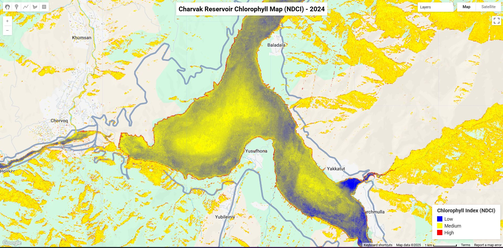

# Day 20: Water

## Overview
Water quality analysis for Charvak Reservoir using NDWI (Normalized Difference Water Index) from satellite imagery.



## Study Area: Charvak Reservoir
Mountain reservoir in Tashkent Province, major water source for the region.

## NDWI Analysis

**Normalized Difference Water Index:**
```
NDWI = (Green - NIR) / (Green + NIR)
```

**Interpretation:**
- NDWI > 0.3 → Water bodies
- NDWI 0.0-0.3 → Wetlands, moist soil
- NDWI < 0.0 → Vegetation, dry land

## Google Earth Engine Code

```javascript
// Charvak NDWI Analysis
var charvak = ee.Geometry.Rectangle([69.65, 41.59, 69.77, 41.67]);

// Load Sentinel-2 imagery
var s2 = ee.ImageCollection('COPERNICUS/S2_SR')
    .filterBounds(charvak)
    .filterDate('2025-01-01', '2025-06-01')
    .filter(ee.Filter.lt('CLOUDY_PIXEL_PERCENTAGE', 10));

// Calculate NDWI
var ndwi = s2.map(function(img) {
    return img.normalizedDifference(['B3', 'B8']).rename('NDWI');
});

// Visualize
var ndwiVis = {
    min: -0.5,
    max: 0.5,
    palette: ['brown', 'white', 'blue']
};

Map.addLayer(ndwi.median(), ndwiVis, 'NDWI');
```

## Water Quality Indicators
- **Turbidity** - Suspended sediments
- **Chlorophyll** - Algae concentration
- **Water extent** - Seasonal variation
- **Temperature** - Surface water temp

## Analysis Outputs
- Water body delineation
- Seasonal water level changes
- Water quality proxy (turbidity)
- Reservoir extent mapping

## Files
- `CharvakNDWI.js` - Google Earth Engine script
- `water.jpg` - NDWI visualization

## Satellite Data
**Sentinel-2:**
- Band 3 (Green): 560nm
- Band 8 (NIR): 842nm
- Resolution: 10m
- Temporal: 5-day revisit

## Applications
- Water resource management
- Reservoir monitoring
- Water quality assessment
- Environmental monitoring
- Drought analysis

## Regional Significance
Charvak Reservoir supplies water to Tashkent region. Monitoring water quality and extent is crucial for:
- Drinking water supply
- Hydroelectric power
- Recreation
- Flood control

## Tools Used
- **Google Earth Engine** - Cloud-based processing
- **Sentinel-2** - Multispectral imagery
- **NDWI** - Water detection index
- **JavaScript** - GEE coding
