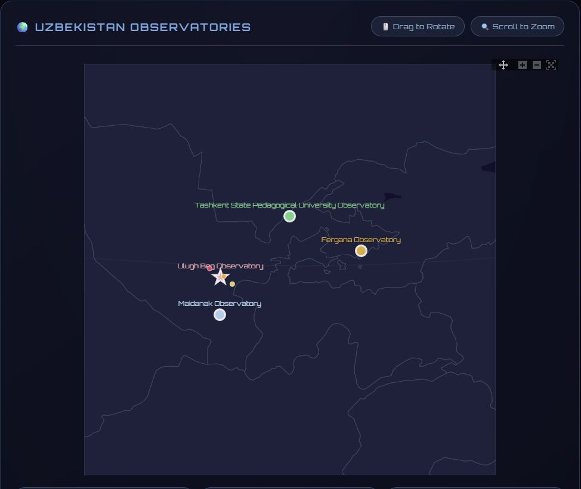

# Day 23: Process

## Overview
Behind-the-scenes look at the mapping workflow - documenting the cartographic process.



## Mapping Workflow Documentation

### Typical Cartographic Process

**1. Planning Phase**
- Define objective
- Identify data requirements
- Choose appropriate tools
- Sketch initial concept

**2. Data Acquisition**
- Download satellite imagery
- Extract OSM data
- Access statistical databases
- Prepare boundary files

**3. Data Processing**
```python
# Typical processing workflow
import geopandas as gpd
import rasterio

# 1. Load data
data = gpd.read_file('source.geojson')

# 2. Clean and transform
data = data.to_crs('EPSG:32641')  # UTM for Uzbekistan
data = data[data.geometry.is_valid]

# 3. Analysis
data['density'] = data['population'] / data['area']

# 4. Export
data.to_file('processed.geojson')
```

**4. Analysis**
- Spatial operations
- Statistical calculations
- Classification
- Pattern identification

**5. Visualization**
- Color scheme selection
- Symbol design
- Layout composition
- Typography

**6. Refinement**
- Iterate on feedback
- Adjust styling
- Optimize performance
- Final quality check

**7. Export & Share**
- High-resolution export
- Web deployment
- Documentation
- Metadata creation

## Tools in the Workflow

**Data Acquisition:**
- OpenStreetMap (Overpass Turbo)
- Google Earth Engine
- USGS Earth Explorer
- Natural Earth Data

**Processing:**
- Python (GeoPandas, Rasterio)
- QGIS
- ArcGIS Pro
- R (sf, terra)

**Visualization:**
- Matplotlib / Seaborn
- Leaflet.js / MapLibre
- Canva / Illustrator
- Cesium.js (3D)

**Deployment:**
- GitHub Pages
- HTML/CSS/JavaScript
- Interactive notebooks
- Static exports

## Common Challenges

**Data Quality:**
- Missing values
- Coordinate system issues
- Geometry errors
- Attribute inconsistencies

**Performance:**
- Large datasets
- Complex geometries
- Rendering speed
- Memory limitations

**Design:**
- Color accessibility
- Information hierarchy
- Visual balance
- Cross-platform compatibility

## Best Practices

✅ **Document everything** - Code comments, README files
✅ **Version control** - Git for tracking changes
✅ **Reproducibility** - Scripts over manual processes
✅ **Data validation** - Check inputs and outputs
✅ **Iterative design** - Multiple drafts
✅ **User feedback** - Test with audience

## Process Transparency
Sharing the process:
- Builds trust in results
- Enables reproducibility
- Facilitates learning
- Encourages collaboration
- Improves methodology

## Files
Process documentation, workflow diagrams, intermediate outputs

## Educational Value
Understanding the process is as important as the final product - it reveals the decisions, challenges, and iterations behind every map.
