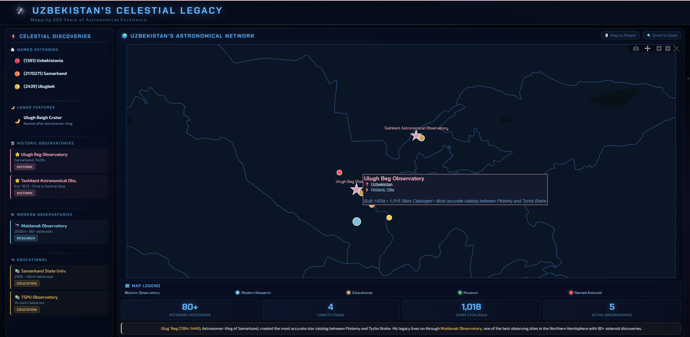

# Day 24: Places and Names

## Overview
Uzbekistan's Celestial Legacy - mapping astronomical heritage and celestial namesakes.



## 600 Years of Astronomy, Mapped ✨

From Ulugh Beg's 15th-century observatory in Samarkand to modern Maidanak Observatory - Uzbekistan's astronomical heritage is written both on Earth and in space.

## Celestial Namesakes

### Lunar Features
🌙 **Ulugh Beigh Crater**
- Location: Moon's surface
- Named after: Ulugh Beg (1394-1449)
- Significance: Medieval astronomer-king

### Asteroids
🪨 **(2439) Ulugbek**
- Discovery: 1977
- Named after Ulugh Beg

🪨 **(1381) Uzbekistania**
- Discovery: 1934
- Named after Uzbekistan

🪨 **(2170271) Samarkand**
- Named after historic astronomy center

## Observatories in Uzbekistan

### Historical
**1. Ulugh Beg Observatory (Samarkand)**
- Built: 1424-1429
- Achievement: Star catalog of 1,018 stars
- Accuracy: Remained unmatched for 200 years
- Instrument: 40m radius sextant

### Modern
**2. Maidanak Observatory**
- Location: Uzbekistan mountains
- Achievements: 80+ asteroid discoveries
- Altitude: 2,600m (excellent seeing conditions)
- Active research facility

**3-5. Additional Observatories**
- Kitab Geodetic Observatory
- Tashkent Astronomical Institute
- Regional observation stations

## Toponymy (Place Names)

### Astronomical Heritage in Geography
- Ulugh Beg districts in multiple cities
- Astronomy-themed street names
- Observatory locations as landmarks
- Star catalog references

## Ulugh Beg's Legacy

**Zij-i Sultani (Star Catalog):**
```
Published: 1437
Stars cataloged: 1,018
Precision: ~1 arc-minute
Innovation: Naked-eye observation accuracy
Impact: Used by astronomers until 1600s
```

## Cultural Significance

**Why it matters:**
- Science and Islamic Golden Age
- Mathematical astronomy advancement
- Samarkand as intellectual center
- Modern scientific heritage
- International recognition

## Data Visualization

**Map Elements:**
- 📍 Observatory locations
- ⭐ Celestial object positions
- 🗺️ Historical trade routes
- 📚 Astronomical manuscripts
- 🔭 Modern research sites

## Tools Used
- Historical maps and documents
- Astronomical databases (IAU)
- GIS for location mapping
- Timeline visualization
- Custom illustrations

## Applications
- Cultural heritage preservation
- Science education
- Tourism development
- Historical research
- Astronomy outreach

## Educational Impact
Connecting Uzbekistan's rich astronomical heritage with modern space science inspires new generations of scientists and preserves cultural memory.

## Sources
- International Astronomical Union (IAU)
- UNESCO World Heritage data
- Historical astronomy archives
- Modern observatory reports
