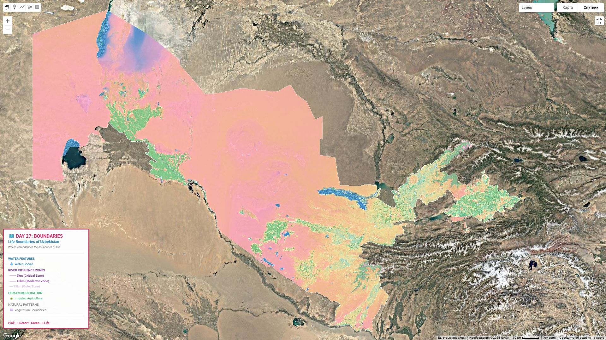

# Day 27: Boundaries

## Overview
Administrative and natural boundaries of Uzbekistan - exploring territorial divisions.



## Administrative Hierarchy

### National Level
**Republic of Uzbekistan**
- Capital: Tashkent
- Area: 448,978 km²
- Population: ~35 million

### Regional Level (Viloyat)
**12 Regions + 1 Autonomous Republic:**
1. Tashkent Province
2. Samarkand
3. Bukhara
4. Khorezm
5. Fergana
6. Andijan
7. Namangan
8. Kashkadarya
9. Surkhandarya
10. Jizzakh
11. Sirdaryo
12. Navoiy
13. **Karakalpakstan** (autonomous republic)

### City of Republican Significance
- **Tashkent City** (separate from Tashkent Province)

### District Level (Tuman)
- ~200 districts across the country

## Natural Boundaries

### Mountain Ranges
- **Tian Shan** - Northeast border (Kyrgyzstan)
- **Pamir-Alay** - Southeast (Tajikistan)
- **Gissar Range** - South

### Rivers as Boundaries
- **Amu Darya** - Southwest (Turkmenistan border)
- **Syr Darya** - North (Kazakhstan border segments)

### Deserts
- **Kyzylkum** - Central Uzbekistan
- **Karakum** - Southwest border region

## International Borders

```
Border lengths:
├── Kazakhstan:    2,330 km (longest)
├── Turkmenistan:  1,793 km
├── Tajikistan:    1,312 km
├── Kyrgyzstan:    1,314 km
└── Afghanistan:     144 km (shortest)

Total: 6,893 km of international borders
```

## Boundary Types

**Administrative:**
- Defined by decree
- Historical evolution
- Political negotiations

**Natural:**
- Mountain watersheds
- River courses
- Desert transitions

**Cultural:**
- Ethnic distributions
- Language zones
- Historical regions

## Enclaves & Exclaves

Uzbekistan has complex boundary situations:
- 4 exclaves surrounded by Kyrgyzstan
- Neighborhing to Fergana Valley enclaves
- Complex territorial arrangements

## Boundary Data Sources

**Official:**
- State cadastre
- Administrative codes (SOATO)
- Ministry of Justice

**Open Data:**
- Natural Earth
- OpenStreetMap
- GADM (Database of Global Administrative Areas)

## GIS Representation

```python
# Load administrative boundaries
import geopandas as gpd

# Regional boundaries
regions = gpd.read_file('uzbekistan_regions.geojson')

# Visualize
regions.plot(column='region_name',
            legend=True,
            edgecolor='black',
            linewidth=0.8)
```

## Boundary Disputes

**Resolved:**
- Most borders demarcated post-independence (1991)
- Agreements with neighbors ongoing

**Complex areas:**
- Fergana Valley tri-border (UZ-KG-TJ)
- Enclave territories
- Water resource boundaries

## Historical Changes

- **Pre-1924:** Part of Russian Empire, then Turkestan ASSR
- **1924-1991:** Uzbek SSR boundaries
- **1991-present:** Independent republic borders

## Tools Used
- **GADM** - Administrative boundaries
- **Natural Earth** - Physical features
- **QGIS** - Cartography
- **Python** - GeoPandas analysis

## Applications
- Regional planning
- Resource allocation
- Electoral districts
- Census geography
- Development programs
