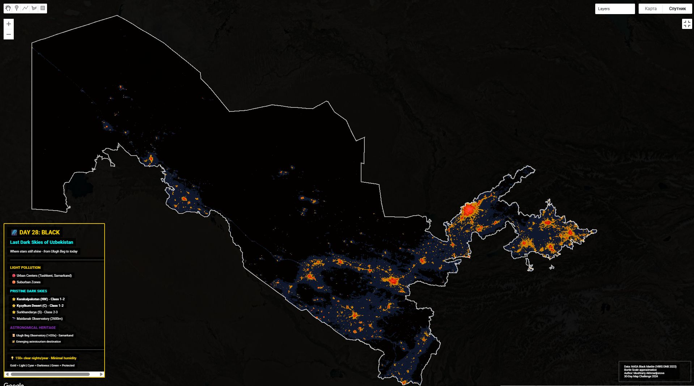

# Day 28: Black and White

## Overview
Monochrome cartography - minimalist black and white mapping.



## Black and White Aesthetics

### Design Principles
- **High contrast** - Clear visual hierarchy
- **Simplicity** - Focus on essential elements
- **Timeless** - Classic cartographic style
- **Clarity** - Enhanced readability
- **Elegance** - Professional appearance

## Grayscale Palette

**Tonal Range:**
```
Black:   #000000  ████████  (darkest)
Gray 1:  #333333  ████████
Gray 2:  #666666  ████████
Gray 3:  #999999  ████████
Gray 4:  #CCCCCC  ████████
White:   #FFFFFF  ████████  (lightest)
```

## Cartographic Elements

**Typical B&W Map Components:**
- Base layer: Light gray or white
- Water bodies: Medium gray
- Roads: Dark gray to black
- Boundaries: Varied line weights
- Labels: Black text
- Patterns: Hatching, stippling, cross-hatching

## Google Earth Engine Code

```javascript
// Black and white satellite imagery
var image = ee.Image('COPERNICUS/S2_SR/20250101T053239_20250101T053819_T42TXR')
    .select(['B8', 'B4', 'B3']);

// Convert to grayscale
var gray = image.reduce(ee.Reducer.mean());

// High contrast visualization
var grayVis = {
    min: 0,
    max: 3000,
    palette: ['black', 'white']
};

Map.addLayer(gray, grayVis, 'B&W');
```

## Techniques

### 1. Grayscale Conversion
- RGB to luminosity
- Weighted channel average
- Desaturation

### 2. Contrast Enhancement
- Histogram equalization
- Levels adjustment
- Gamma correction

### 3. Pattern Fill
- Hatching for areas
- Stippling for texture
- Cross-hatching for emphasis

## Historical Context

**Traditional B&W Cartography:**
- Pre-color printing limitation
- Engraved maps
- Lithographic techniques
- Photographic reproductions

**Modern Revival:**
- Minimalist design trend
- Screen readability
- Print cost reduction
- Aesthetic choice

## Advantages

✅ **Print-friendly** - Cheaper printing
✅ **Accessible** - Colorblind-safe
✅ **Professional** - Clean, serious tone
✅ **Timeless** - Won't look dated
✅ **Focus** - No color distraction
✅ **Versatile** - Works anywhere

## Data Visualization in B&W

**Without color, rely on:**
- Line weight variation
- Pattern differentiation
- Tonal gradations
- Symbol shapes
- Texture contrast
- Typography hierarchy

## Files
- `day28.js` - Google Earth Engine script
- `black.jpg` - B&W visualization

## Tools Used
- **Google Earth Engine** - Satellite imagery
- **Image processing** - Grayscale conversion
- **Cartographic software** - QGIS, Illustrator
- **JavaScript** - GEE coding

## Applications
- Academic publications
- Print media
- Screen accessibility
- Archival maps
- Minimalist design
- Cost-effective printing

## Artistic Value
Black and white mapping emphasizes form, structure, and spatial relationships without the emotional weight of color - a return to cartography's purest expression.
