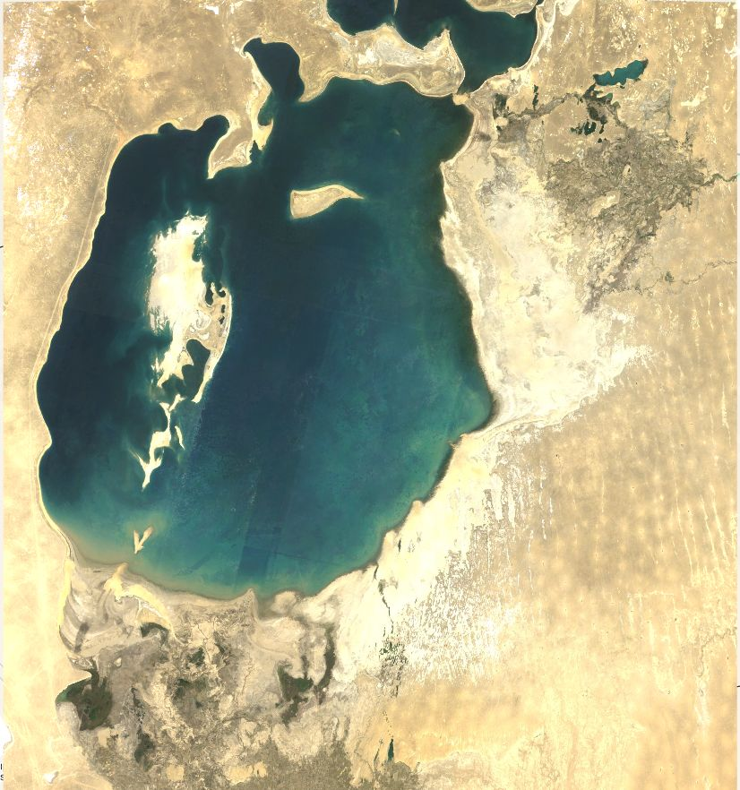

# Day 29: Raster

## Overview
Raster data analysis for the Aral Sea region - gridded environmental monitoring.



## Raster Data Structure

**Grid-based representation:**
```
Raster = Matrix of pixels/cells
Each cell = Single value
Regular grid = Equal-sized cells
Multi-band = Multiple layers
```

**Example:**
```
[125, 130, 128, 132]  → Row 1
[127, 129, 131, 133]  → Row 2
[124, 126, 130, 135]  → Row 3
 ↑    ↑    ↑    ↑
Values represent surface properties
```

## Aral Sea Raster Analysis

### Satellite Imagery
**Landsat Time Series:**
- 30m resolution
- 1985 - 2025 coverage
- Multi-spectral bands
- Thermal infrared

### Raster Datasets Used
1. **Optical imagery** (Landsat, Sentinel-2)
2. **NDWI** (Water detection index)
3. **Land Surface Temperature** (Thermal)
4. **NDVI** (Vegetation health)
5. **DEM** (Elevation data)

## Raster Operations

### Band Math
```python
import rasterio
import numpy as np

# Calculate NDWI
with rasterio.open('landsat.tif') as src:
    green = src.read(3)  # Band 3
    nir = src.read(5)    # Band 5

    # NDWI formula
    ndwi = (green - nir) / (green + nir)
```

### Reclassification
```python
# Water presence classification
water_mask = np.where(ndwi > 0.3, 1, 0)

# Multi-class reclassification
classes = np.select(
    [ndwi < 0, (ndwi >= 0) & (ndwi < 0.2), ndwi >= 0.2],
    [0, 1, 2],  # Land, Wetland, Water
    default=0
)
```

### Zonal Statistics
```python
from rasterstats import zonal_stats

# Calculate stats per region
stats = zonal_stats(
    "aral_zones.geojson",
    "ndwi.tif",
    stats=['mean', 'min', 'max', 'count']
)
```

## Analysis Workflow

**1. Data Acquisition**
- Download satellite imagery
- Pre-processed surface reflectance

**2. Pre-processing**
- Cloud masking
- Atmospheric correction
- Mosaicking
- Reprojection

**3. Analysis**
- Index calculation (NDWI, NDVI, LST)
- Change detection
- Time series analysis
- Statistical summaries

**4. Visualization**
- Color ramps
- Hillshade
- Multi-temporal composites
- Export to raster formats

## Raster vs Vector

| Aspect | Raster | Vector |
|--------|--------|--------|
| Structure | Grid of pixels | Points, lines, polygons |
| Best for | Continuous data | Discrete features |
| Examples | Temperature, elevation | Roads, boundaries |
| File size | Can be large | Usually smaller |
| Analysis | Cell-based | Geometry-based |

## Raster Formats

- **GeoTIFF** (.tif) - Georeferenced TIFF
- **NetCDF** (.nc) - Multi-dimensional arrays
- **HDF** (.hdf) - Hierarchical data
- **IMG** (.img) - ERDAS Imagine
- **JP2** (.jp2) - JPEG 2000

## Key Raster Concepts

**Resolution:**
- Spatial: Cell size (30m, 10m, 1m)
- Temporal: Time between acquisitions
- Spectral: Number and width of bands
- Radiometric: Bit depth (8-bit, 16-bit)

**Coordinate Reference System:**
- Must have CRS for georeferencing
- Common: UTM zones, WGS 84

## Tools Used
- **Rasterio** (Python) - Raster I/O
- **GDAL** - Geospatial Data Abstraction Library
- **Google Earth Engine** - Cloud processing
- **QGIS** - Visualization
- **NumPy** - Array operations

## Applications
- **Environmental monitoring** - Aral Sea changes
- **Agriculture** - Crop health (NDVI)
- **Climate** - Temperature mapping
- **Hydrology** - Water extent tracking
- **Terrain analysis** - Elevation models

## Aral Sea Findings
Raster analysis reveals:
- Water extent decline (1960-2025)
- Salinity increase (spectral signatures)
- Temperature changes (thermal bands)
- Vegetation loss (NDVI trends)

## Files
- `day29_aralsea/` - Raster analysis folder
- `raster.jpg` - Visualization output

## Processing Power
Raster analysis benefits from:
- Parallel processing (GPU acceleration)
- Cloud computing (GEE, AWS)
- Chunked reading (Dask, Xarray)
- Efficient algorithms (GDAL)
