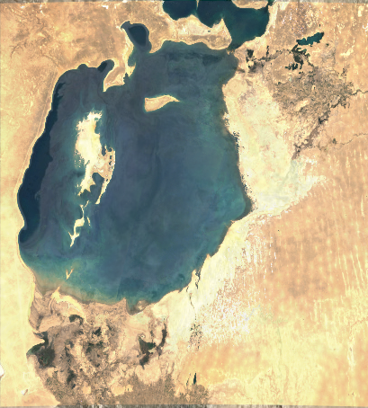
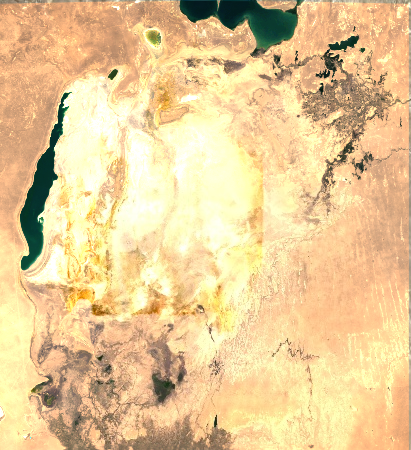

# Day 30: Makeover

## Overview
Professional enhancement of the Aral Sea environmental catastrophe visualization - a 40-year timelapse (1984-2024) showing one of Earth's greatest environmental disasters.

## Visualizations

### Timelapse Animation


*Animated versions:* [showcase_aral.gif](showcase_aral.gif) (2.6MB) | [aral_sea_timelapse.gif](aral_sea_timelapse.gif) (11MB)

### Before & After Comparison
 

## The Aral Sea Catastrophe

**Historical context:**
- 1960: 4th largest lake in the world (68,000 km²)
- 2024: <10% of original size
- **Lost:** >90% of water volume
- **Cause:** Soviet irrigation diversion (Amu Darya, Syr Darya)

## Visual Enhancements (Makeover)

### Color Grading
- ✨ **Natural tones** - Enhanced teal-blue water
- 🎨 **Depth gradients** - NDWI-based color coding
- 🌊 **Water clarity** - Clean, vibrant visualization

### Technical Improvements
- ☁️ **Cloud masking** - QA_PIXEL bands for clean composites
- 🧩 **Seamless imagery** - 3-year median composites
- 📐 **Tile-free** - No visible Landsat tile boundaries
- 🎯 **Change detection** - Lost/persistent/regained water overlays

## Key Features

**Multi-sensor Integration:**
```javascript
// Landsat sensor harmonization
Landsat 5 (TM):   1984-2011
Landsat 7 (ETM+): 1999-2020
Landsat 8 (OLI):  2013-2024
```

**Water Detection:**
```javascript
// NDWI calculation
var ndwi = image.normalizedDifference(['Green', 'NIR']);

// Water threshold
var water = ndwi.gt(0.3);

// Calculate area
var waterArea = water.multiply(ee.Image.pixelArea())
                     .reduceRegion({
                       reducer: ee.Reducer.sum(),
                       geometry: aralSea,
                       scale: 30
                     });
```

## Surface Area Analysis

**Trends:**
```
1984:  ~40,000 km²
1990:  ~35,000 km²
2000:  ~17,000 km²
2010:   ~8,000 km²
2024:   ~6,000 km²

Total loss: ~85% (34,000 km²)
```

## Technical Stack

**Platform:** Google Earth Engine (JavaScript API)
**Data:** Landsat Collection 2 Level-2 SR
**Resolution:** 30m
**Period:** 1984-2024 (41 years)
**Region:** 58.0-62.5°E, 43.0-46.5°N

**Outputs:**
- 41 annual PNG frames
- Interactive GEE visualization
- Time-series area chart
- Change detection layers
- Professional timelapse GIF

## Processing Workflow

**1. Data Collection**
```javascript
// Load multi-sensor Landsat
var l5 = ee.ImageCollection('LANDSAT/LT05/C02/T1_L2');
var l7 = ee.ImageCollection('LANDSAT/LE07/C02/T1_L2');
var l8 = ee.ImageCollection('LANDSAT/LC08/C02/T1_L2');

// Merge collections
var landsat = l5.merge(l7).merge(l8);
```

**2. Pre-processing**
- Cloud masking (QA_PIXEL band)
- Atmospheric correction (Level-2 data)
- 3-year median composites
- Spectral harmonization

**3. Water Detection**
- NDWI calculation
- Threshold classification
- Area computation
- Temporal aggregation

**4. Visualization**
- Color grading (professional palette)
- Legend creation
- Animation export
- Change overlays

## Environmental Impact

**Consequences:**
- 🐟 Fishing industry collapse
- 🧂 Salt storms (toxic dust)
- 🌡️ Climate change (local)
- 💧 Water quality degradation
- 🏚️ Abandoned coastal cities
- 🌾 Cotton monoculture damage

## Files
- `day30_makeover.js` - Google Earth Engine code
- `aral_sea_timelapse.gif` - Full animation (11MB)
- `showcase_aral.gif` - Compressed version (2.6MB)
- `day30_pre.png` - 1984 baseline
- `day30_post.png` - 2024 current state

## Tools Used
- **Google Earth Engine** - Cloud processing
- **Landsat Collection 2** - Multi-sensor data
- **JavaScript** - GEE API
- **NDWI** - Water detection
- **Animation tools** - Timelapse creation

## Makeover Elements

**Before (original):**
- Basic NDWI visualization
- Single-year snapshots
- No temporal smoothing
- Standard color palette

**After (makeover):**
- ✅ Enhanced color grading
- ✅ Multi-year composites
- ✅ Cloud-free imagery
- ✅ Professional animation
- ✅ Change detection overlays
- ✅ Area statistics chart
- ✅ Interactive legend

## Global Significance
The Aral Sea disaster serves as a cautionary tale for:
- Water resource management
- Large-scale irrigation projects
- Environmental impact assessment
- Cross-border water cooperation
- Climate adaptation

## Educational Value
This visualization communicates 40 years of environmental change in seconds - making abstract data tangible and driving awareness of human-caused ecological transformation.

---

**🌍 Final project of #30DayMapChallenge showcasing the power of satellite imagery to document environmental change at massive scales.**
